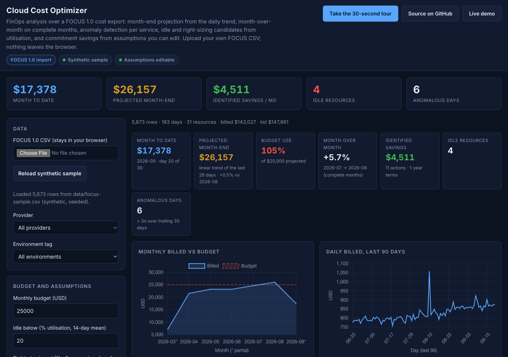
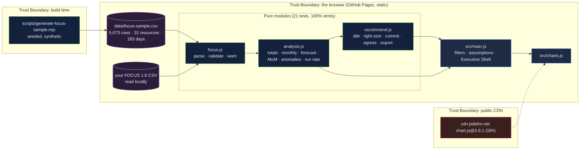

# Cloud Cost Optimizer: FinOps analysis over a FOCUS export, with every saving showing its basis

[](https://github.com/Freddricklogan/cloud-cost-optimizer/actions/workflows/deploy.yml)
[](#5-getting-started--verification)
[](https://github.com/Freddricklogan/cloud-cost-optimizer/actions/workflows/codeql.yml)
[](LICENSE)
[](https://freddricklogan.github.io/cloud-cost-optimizer/)

## 1. Executive Summary & Business Impact

**Problem statement.** Cloud cost dashboards earn trust by looking
finished, and the previous version of this page looked finished: a
"+8.3% vs last month" that was a string literal, "potential savings"
that were 28 % of any total, a trend chart drawn from `Math.random`, and
six recommendation percentages with no source (`AUDIT.md`). None of it
could be checked against a bill.

**Solution & value delivered.** A dashboard that reads a FOCUS 1.0
export — the FinOps Open Cost and Usage Specification that AWS, Azure
and Google now emit — and computes what it shows: month-to-date and a
month-end projection from a linear trend of the last 28 days,
month-over-month on complete months only, per-service anomaly days
beyond three standard deviations of a trailing 30-day mean, idle and
right-sizing candidates from 14-day mean utilisation, and commitment
savings from discount rates you enter, labelled as assumptions until you
do. Each recommendation carries its basis. Upload your own export; rows
that fail validation are listed, and nothing leaves the browser. The
shipped sample is synthetic, seeded, and says so.

**[→ Read the full case study](docs/CASE_STUDY.md)**



## 2. Demonstrated Competencies & Technical Skills

- **Cloud FinOps** — FOCUS 1.0 ingestion (BilledCost, ListCost,
  PricingCategory, Tags, `x_` extension columns), run-rate and
  projection method, commitment versus on-demand, right-sizing rules
  that respect a utilisation target, egress reported as an observation.
- **Data Science & Modelling** — least-squares trend, complete-month
  comparison, trailing-window z-score anomalies, reconciliation tests
  that every grouping sums to the same total.
- **Security & Compliance** — strict CSP, SRI with a vendored fallback,
  uploaded CSV treated as untrusted text, no `innerHTML`; CodeQL and
  Trivy in CI.
- **Engineering Practice** — pure modules at 100 % statement coverage
  with failure paths (missing columns, bad rows, mixed currencies,
  too-short series); a seeded generator for the sample so it can be
  regenerated, not edited.

## 3. System Architecture & Data Flow



No backend, no account, no telemetry. An uploaded export is parsed in
the page and never transmitted.

## 4. Technical Highlights & Engineering Decisions

### ADR-1 — Take FOCUS as the input, not a hand-typed inventory

**Context.** The old page held 31 resources with one cost and one
utilisation each; nothing could be trended, forecast or flagged.

**Decision.** The input is a FOCUS 1.0 CSV: six required columns, the
rest optional, utilisation through the specification's `x_` extension
mechanism. `parseFocusCsv` validates every row, drops the bad ones with
a numbered warning, and refuses files missing the required columns.

**Consequence.** The dashboard works on a real export from any of the
three providers, and the synthetic sample is regenerated by a seeded
script rather than edited by hand.

### ADR-2 — Projection and comparison with stated methods

**Context.** "+8.3%" was a constant; the trend was random.

**Decision.** `forecastMonth` fits a least-squares line to the last 28
daily totals and extrapolates over the remaining days of the month;
`monthOverMonth` compares only months whose day count is complete;
partial months are starred on the chart.

**Consequence.** `tests/analysis.test.js` checks the fit against exact
linear data, a flat series against elapsed-day scaling, and that the
complete-month rule returns `null` when there are not two.

### ADR-3 — Savings are arithmetic on a run rate and a named assumption

**Context.** Six percentages with no source produced the savings tile.

**Decision.** Idle saving is the resource's 14-day run rate. Right-sizing
uses one explicit ratio (one size step halves the price) and fires only
when `utilisation ÷ ratio ≤ target` and a smaller size exists.
Commitment savings use discount inputs whose defaults are labelled
placeholders. Egress and anomalies carry no saving; they are
observations with measured numbers.

**Consequence.** Every line on the page and in the exported CSV states
its basis, and changing an assumption changes the number in front of
you — the tour does exactly that.

## 5. Getting Started & Verification

**Prerequisites.** Node 22 LTS. No build step; the page is served from the
repository root.

```bash
git clone https://github.com/Freddricklogan/cloud-cost-optimizer.git
cd cloud-cost-optimizer
npm ci
npm run lint && npm run validate && npm run coverage
npx serve .    # open http://localhost:3000
node scripts/generate-focus-sample.mjs   # regenerate the synthetic sample (seeded)
```

**Verification — the numbers this repository actually produced:**

```bash
npm run coverage   # 21 passed / 21; All files 100% stmts, 87.25% branches
npm run lint       # 0 problems
npm run validate   # html-validate index.html: clean
```

| Check | Result |
| --- | --- |
| Unit tests (Vitest) | **21 passed / 21** across 3 files |
| Coverage (pure modules) | **100%** statements, **87.25%** branches (`main.js`, `ui.js`, `charts.js` covered by the browser smoke test) |
| ESLint, html-validate | clean |
| Sample data | 5,673 rows, 31 resources, 3 providers, 183 days ending 2026-09-20, 0 rejected rows |
| Headless Chrome smoke | **0 console errors**; sample loads: billed $143,027 over the period, month-to-date $17,378 (day 20 of 30), projected $26,157, MoM +5.7% (2026-07 → 2026-08), 17 recommendations, 4 idle, 6 anomalous days; GCP filter → 9 resources; dev tag → 2 idle; budget $20,000 → 131% flagged; 1-year discount 10% lowers identified savings from $4,511 to $3,048; four tour steps; no horizontal scroll at 1280 or 400 px |

## 6. Live Demo & Production Showcase

**<https://freddricklogan.github.io/cloud-cost-optimizer/>**

**30-second guided walkthrough.** Press **Take the 30-second tour**: it
explains the projection and month-over-month method, changes a
commitment assumption so you can watch the savings move, points at the
anomaly count, and filters to one provider. Then upload a FOCUS export
of your own.
